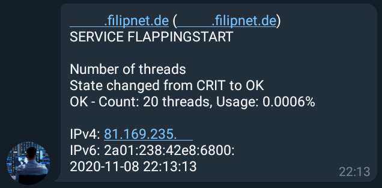
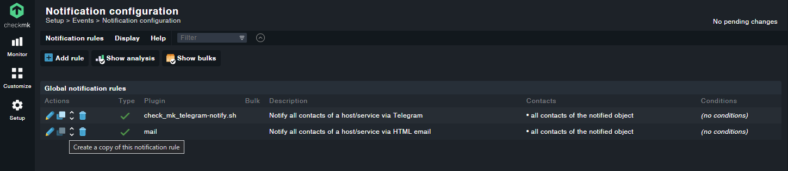
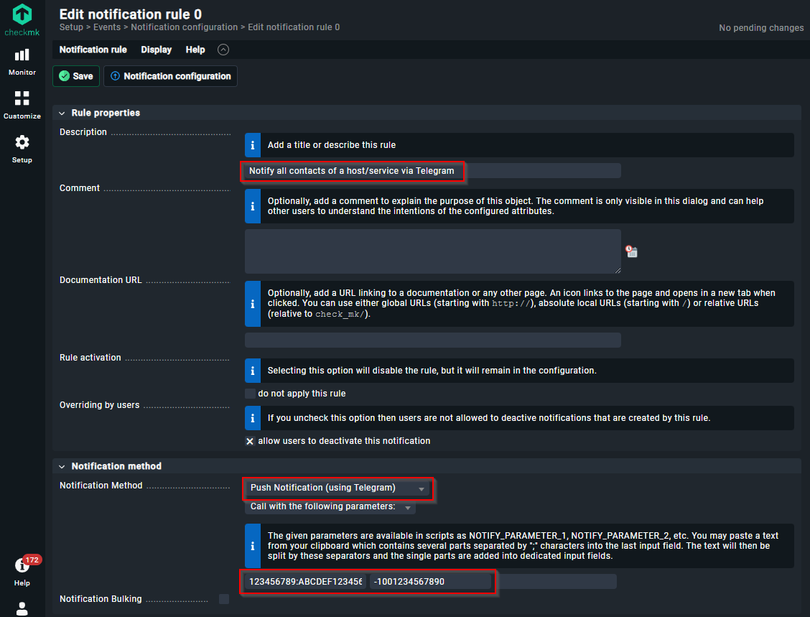
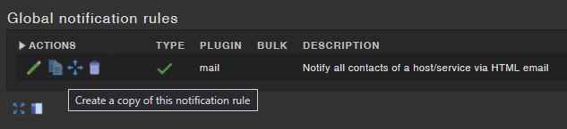
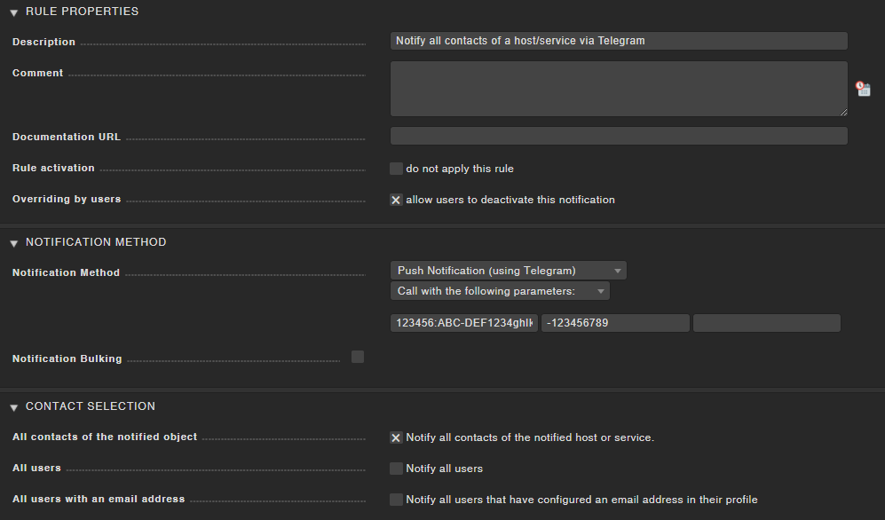
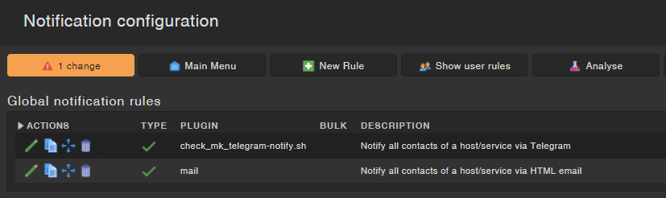
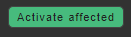
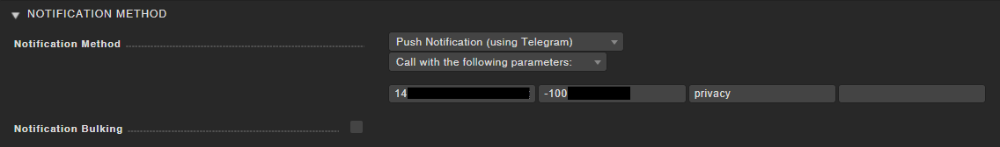

# Check_MK Telegram notification

Telegram has long been one of my real-time communication media. It is obvious to output monitoring messages for server and network components as alarm messages. There are several scripts for this on the internet, but most of them are written in Python, many of them have problems with Python3 and its libraries. Instead of spending hours and hours with Python, I decided to use a scripting language I know and write a Linux Bash script for it. 


<!-- TOC -->

- [Check_MK Telegram notification](#check_mk-telegram-notification)
    - [COMPATIBILITY](#compatibility)
    - [EXAMPLE](#example)
    - [REQUIREMENTS](#requirements)
    - [INSTALLATION](#installation)
    - [CHECK_MK CONFIGURATION](#check_mk-configuration)
        - [CHECK_MK VERSION 2.0.0 AND ABOVE](#check_mk-version-200-and-above)
        - [CHECK_MK VERSION 1.6.0](#check_mk-version-160)
        - [ACTIVATE CHANGES](#activate-changes)
        - [PRIVACY ANONYMIZATION / MASQUERADING](#privacy-anonymization--masquerading)
    - [PAGER ADDRESS CHAT-ID INSTEAD OF TELEGRAM GROUP-ID](#pager-address-chat-id-instead-of-telegram-group-id)
    - [TROUBLESHOOTING](#troubleshooting)
    - [CONTRIBUTION](#contribution)
    - [LICENSE](#license)

<!-- /TOC -->

## COMPATIBILITY
- Check_MK RAW version 1.6.0_p18 
- Check_MK RAW version 2.0.0_p8
- Should also work with other versions of Check_MK

## EXAMPLE
Notifications are usually sent via a Telegram group. Here is an example of how a Telegram notification is structured.



## REQUIREMENTS
In order for Check_MK to send alerts (notifications) to the Telegram Messenger, we need

* a Telegram bot
* a username for the bot
* an API token
* a Telegram Chat- or Group-ID

There are a lot of good instructions for this on the Internet, so this is not part of this documentation.

## INSTALLATION
Change to your Check_MK site user
```
su - mysite
```

Change to the notification directory
```
cd ~/local/share/check_mk/notifications/
```

Download the Telegram notify script from Git repository
```
git clone https://github.com/filipnet/checkmk-telegram-notify.git .
```

Give the script execution permissions
```
chmod +x check_mk_telegram-notify.sh
```

## CHECK_MK CONFIGURATION
### CHECK_MK VERSION 2.0.0 AND ABOVE
Now you can create your own alarm rules in Check_MK.

```Setup → Events → Notifications```

First create a clone of your existing mail notification rule



* Change the description (e.g. Notify all contacts of a host/service via Telegram)
* The notification method is "Push Notification (by Telegram)"
* Select option "Call with the following parameters:"
* As the first parameter we set the Telegram token ID (without bot-prefix)
* The second parameter is the Telegram Chat-ID or Telegram Group-ID



### CHECK_MK VERSION 1.6.0
Now you can create your own alarm rules in Check_MK.

```WATO → Notifications → New Rule → Notification Method → Push Notification (using Telegram)```

First create a clone of your existing mail notification rule



* Change the description (e.g. Notify all contacts of a host/service via Telegram)
* The notification method is "Push Notification (by Telegram)"
* Select option "Call with the following parameters:"
* As the first parameter we set the Telegram token ID (without bot-prefix)
* The second parameter is the Telegram Chat-ID or Telegram Group-ID



If everything was ok, you will see your new Notification Rule afterwards



### ACTIVATE CHANGES
To activate it you have to press "1 Change" and "Activate affected"



Since Check_MK 2.0.0 it is calles "Active on selected sites"


To ensure that the parameters are also transferred in the event of an alert, it is strongly recommended that the Check_MK instance is restarted.
```
su - mysite
omd stop
omd start
```

### PRIVACY ANONYMIZATION / MASQUERADING
The current version of this script allows you to optionally enable IP anonymization. This gives you the option to comply with your own privacy policy or the recommendations of data protection authorities in certain countries if they prohibit the transmission of the full IP address. This masks IPv4 and IPv6 IP addresses before they are transmitted in a message to the Telegram service.

The activation of the privacy settings is realized directly in the Notification Rules in Check_MK by NOTIFY_PARAMETER_3, here the value "privacy" has to be entered:



There are certainly different requirements for privacy and masquerading of IP addresses. In the script, the IPv4 IP address is split into the 4 octets, the IPv6 address into the 8 columns. This allows to control __very individually__ which parts of the addresses are sent via Telegram and which are not. Both, placeholders and manipulations are basically possible here. 

The adjustment is done exclusively in the following two lines of the script.
```
# Adjust the output to your privacy needs here (Details in the readme.md)
NOTIFY_HOST_ADDRESS_4="${sec1}.${sec2}.2.${sec4}"
NOTIFY_HOST_ADDRESS_6="${sec1}:${sec2}:${sec3}:${sec4}:ffff:ffff:ffff:${sec8}"
```

Explanation for the example configuration above:
* 192.168.__143__.104 --> 192.168.__2__.104
* 2001:db8:85a3:8d3:__1319__:__8a2e__:__370__:7348 --> 2001:db8:85a3:8d3:__ffff__:__ffff__:__ffff__:7348

## PAGER ADDRESS (CHAT-ID) INSTEAD OF TELEGRAM GROUP-ID
A different approach is to use the 'Pager address' field in Check_MK's user properties. This gets exported as $NOTIFY_CONTACTPAGER variable to the script and as such all that's needed is:
```
if [ -z ${NOTIFY_CONTACTPAGER} ]; then
        echo "No pager address provided to be used as Chat-ID. Exiting" >&2
        exit 2
else
        CHAT_ID="${NOTIFY_CONTACTPAGER}"
fi
```

## TROUBLESHOOTING
For more details and troubleshooting with parameters please check:

[Check_MK  Manual > Notifications > Chapter: 11.3. A simple example](https://docs.checkmk.com/latest/en/notifications.html#H1:Real)

[[Feature-Request] Multiple Alert Profiles](https://github.com/filipnet/checkmk-telegram-notify/issues/3)

## CONTRIBUTION
* Thank you for the excellent code optimization contributions and additional information @ThomasKaiser.
* Best regards to @intelligent-bytes in Bangkok, Thailand and many thanks for adding emojies to the module.

## LICENSE
checkmk-telegram-notify and all individual scripts are under the BSD 3-Clause license unless explicitly noted otherwise. Please refer to the LICENSE