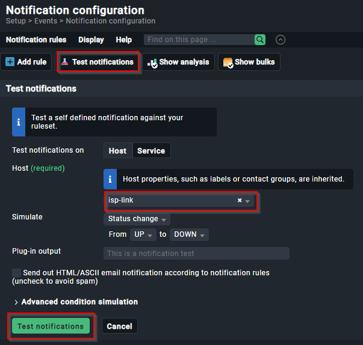
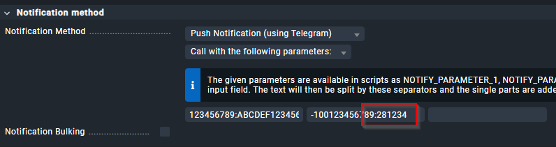
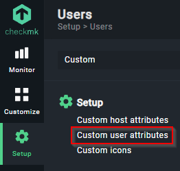
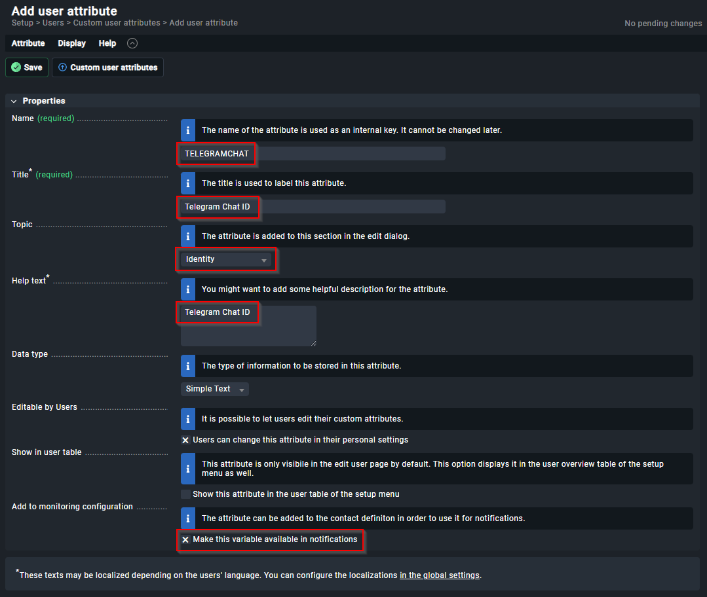
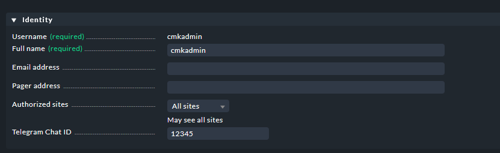
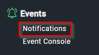
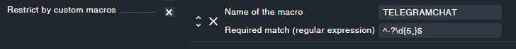

# Check_MK Telegram notification


<!-- TOC -->

- [Check_MK Telegram notification](#check_mk-telegram-notification)
    - [COMPATIBILITY](#compatibility)
    - [EXAMPLE](#example)
    - [REQUIREMENTS](#requirements)
    - [INSTALLATION](#installation)
    - [UPDATE EXISTING INSTALLATION](#update-existing-installation)
    - [CHECK_MK CONFIGURATION](#check_mk-configuration)
        - [ACTIVATE CHANGES](#activate-changes)
        - [TEST NOTIFICATIONS](#test-notifications)
    - [OPTIONAL FEATURES](#optional-features)
        - [USE OF TELEGRAM TOPICS/THREADS](#use-of-telegram-topicsthreads)
        - [PRIVACY ANONYMIZATION / MASQUERADING](#privacy-anonymization--masquerading)
        - [CUSTOM USER ATTRIBUTES](#custom-user-attributes)
        - [CUSTOM MACRO](#custom-macro)
        - [PAGER ADDRESS CHAT-ID INSTEAD OF TELEGRAM GROUP-ID](#pager-address-chat-id-instead-of-telegram-group-id)
    - [TROUBLESHOOTING](#troubleshooting)
    - [CONTRIBUTIONS](#contributions)
    - [LICENSE](#license)

<!-- /TOC -->

## COMPATIBILITY

Understanding compatibility ensures that the plugin works seamlessly with your specific Check_MK version and environment.

- Check_MK RAW version 1.6.0p18 
- Check_MK RAW version 2.3.0p27 for RedHat/CentOS/AlmaLinux/RockyLinux 8 and 9
- Should also work with other versions of Check_MK

## EXAMPLE

Notifications are usually sent via a Telegram group. Here is an example of how a Telegram notification is structured.


## REQUIREMENTS

To enable Check_MK to send notifications via Telegram, you need:

* a Telegram bot
* a username for the bot
* an API token
* a Telegram Chat- or Group-ID

For detailed instructions on creating a Telegram bot, refer to the [official Telegram Bot documentation](https://core.telegram.org/bots#6-botfather).

## INSTALLATION

Switch to the Check_MK site user to ensure proper permissions for the following commands
```
su - mysite
```

Navigate to the notification directory where custom notification scripts are stored
```
cd ~/local/share/check_mk/notifications/
```

Download the Telegram notify script from the Git repository (a new subfolder will be created to store the notification script and its related files, which are essential for the setup process)
```
`git clone https://github.com/filipnet/checkmk-telegram-notify.git`
```

Give the script execution permissions to ensure the script is executable and can be run by the system
```
chmod +x checkmk-telegram-notify/check_mk_telegram-notify.sh

# Verify that the script has the correct permissions
ls -l checkmk-telegram-notify/check_mk_telegram-notify.sh
```
Create a symbolic link to enable the plugin and integrate the notification script into the Check_MK system. This ensures the script is recognized and executed for Telegram notifications. Verify the symlink using `ls -l` to confirm it points to the correct script.

```
ln -s checkmk-telegram-notify/check_mk_telegram-notify.sh check_mk_telegram-notify.sh
```

## UPDATE EXISTING INSTALLATION

To update an existing installation of the Check_MK Telegram notification script, follow these steps to ensure you have the latest features and fixes.

```
su - mysite
cd ~/local/share/check_mk/notifications/checkmk-telegram-notify
git pull
```

## CHECK_MK CONFIGURATION

Now you can create your own alarm rules in Check_MK, which are configurations that define how and when notifications are sent based on specific conditions or events in your monitoring setup.

To navigate to this path in the Check_MK interface, go to the main menu, select "Setup," then "Events," and finally "Notifications."

```Setup → Events → Notifications```

First create a clone of your existing mail notification rule


* Change the description (e.g. Notify all contacts of a host/service via Telegram)
* The notification method is "Push Notification (by Telegram)"
* Select option "Call with the following parameters:"
* As the first parameter we set the Telegram token ID (without bot-prefix), e.g., `123456789:ABCDEF1234567890abcdef1234567890`
* The second parameter is the Telegram Chat-ID or Telegram Group-ID e.g., `-1001234567890`


Referring to #6 and #15 at this point the note that initially only one field is displayed, further fields are only displayed after the first field has been filled.

For configuration in Check_MK Legacy versions (1.x), please refer to [LEGACY_CONFIGURATION.md](LEGACY_CONFIGURATION.md).

### ACTIVATE CHANGES

To activate it you have to press "Active on selected sites" 


Restarting the Check_MK instance ensures that all configuration changes, including notification rules and script parameters, are fully applied and operational. This step helps avoid potential issues where changes might not take effect until the system is restarted.
```
su - mysite
omd stop
omd start
```

### TEST NOTIFICATIONS

You can verify if your notification rules are applied correctly by performing a notification check. Navigate to `Setup > Events > Notifications > Configuration` and use the `Test Notifications` button. This allows you to simulate and confirm the behavior of your notification rules.



## OPTIONAL FEATURES

### USE OF TELEGRAM TOPICS/THREADS

Telegram topics (also referred to as threads) are a feature available in Telegram groups that allow you to organize discussions into separate threads. This is particularly useful for managing notifications in large groups, as it helps keep conversations focused and organized.

To send notifications to a specific topic within a Telegram group, append the `Thread-ID` to the `Group-ID`, separated by a colon. For example: `Group-ID:Thread-ID`.



To find the `Thread-ID`, use the `getUpdates` method of the Telegram Bot API:
```
https://api.telegram.org/bot<YOUR_BOT_TOKEN>/getUpdates
```

In the JSON response, look for the `message_thread_id` field. This field contains the ID of the thread. Example output:
```
... "date":1743786667, "message_thread_id":281234, "forum_topic_created": ...
```

By combining the `Group-ID` and `Thread-ID`, you can ensure that notifications are sent directly to the desired topic within the group.

### PRIVACY ANONYMIZATION / MASQUERADING

The current version of this script allows you to optionally enable IP anonymization. This gives you the option to comply with your own privacy policy or the recommendations of data protection authorities in certain countries if they prohibit the transmission of the full IP address. This masks IPv4 and IPv6 IP addresses before they are transmitted in a message to the Telegram service.

The activation of the privacy settings is realized directly in the Notification Rules in Check_MK by NOTIFY_PARAMETER_3, here the value "privacy" has to be entered:


There are certainly different requirements for privacy and masquerading of IP addresses. In the script, the IPv4 IP address is split into the 4 octets, the IPv6 address into the 8 columns. This allows to control __very individually__ which parts of the addresses are sent via Telegram and which are not. Both, placeholders and manipulations are basically possible here. 

The adjustment is done exclusively in the following two lines of the script.
```
# Adjust the output to your privacy needs here (Details in the readme.md)
NOTIFY_HOST_ADDRESS_4="${sec1}.${sec2}.2.${sec4}"
NOTIFY_HOST_ADDRESS_6="${sec1}:${sec2}:${sec3}:${sec4}:ffff:ffff:ffff:${sec8}"
```

Explanation for the example configuration above:
* 192.168.__143__.104 --> 192.168.__2__.104
* 2001:db8:85a3:8d3:__1319__:__8a2e__:__370__:7348 --> 2001:db8:85a3:8d3:__ffff__:__ffff__:__ffff__:7348

### CUSTOM USER ATTRIBUTES

You can add a custom user attribute and use it in your script. This feature is particularly useful for tailoring notifications to individual users or groups, allowing you to specify unique identifiers like Telegram Chat-IDs directly in user profiles. It ensures that notifications are sent to the correct recipients without requiring manual adjustments in the script.

- Go to: `Setup > Users > Custom User Attributes` 



- Create a custom attribute named `TELEGRAMCHAT` by click to `Add attribute`
- Do NOT change the name, as it is required for compatibility with the notification script and Check_MK's configuration.
- You can change the title and help text
- Make sure you activate the option `Make this variable available in notifications` 



- Edit your user and enter your Group/Chat-ID



### CUSTOM MACRO

- Go to: `Setup > Events > Notifications>` 



- Edit your notifcation. Add a custom macro.

This pattern ensures that only valid Telegram Chat-IDs are used in the notification setup by accepting numbers with or without an optional minus sign and requiring a minimum of 5 digits.:
Regex : ```^-?\d{5,}$```

- Breakdown:
```
^: Start of the string.
-?: An optional minus sign.
\d{5,}: Five or more consecutive digits.
$: End of the string.
```

- The macro ensures that only users with a valid Chat-ID receive notifications.
- It validates the format of the Chat-ID, requiring a numeric value with at least 5 digits (the expected format for Telegram Chat-IDs).
- Users without a valid Chat-ID will not receive notifications.
- This behavior effectively acts as a whitelist, including only users with properly configured Chat-IDs matching the regex pattern.

### PAGER ADDRESS (CHAT-ID) INSTEAD OF TELEGRAM GROUP-ID

A different approach is to use the 'Pager address' field in Check_MK's user properties. This method simplifies configuration by directly linking user properties to the notification script, avoiding the need for additional custom attributes. The 'Pager address' gets exported as $NOTIFY_CONTACTPAGER variable to the script and as such all that's needed is:
```
if [ -z ${NOTIFY_CONTACTPAGER} ]; then
        echo "No pager address provided to be used as Chat-ID. Exiting" >&2
        exit 2
else
        CHAT_ID="${NOTIFY_CONTACTPAGER}"
fi
```



## TROUBLESHOOTING

For more details and troubleshooting with parameters please check:
* Check_MK notification logfile: ```tail -f /omd/sites/{sitename}/var/log/notify.log```
* [Check_MK  Manual > Notifications > Chapter: 11.3. A simple example](https://docs.checkmk.com/latest/en/notifications.html#H1:Real)
* [[Feature-Request] Multiple Alert Profiles](https://github.com/filipnet/checkmk-telegram-notify/issues/3)

## CONTRIBUTIONS

* Thank you for the excellent code optimization contributions and additional information [ThomasKaiser](https://github.com/ThomasKaiser).
* Best regards to [Jonathan Barratt](https://github.com/reduxionist) in Bangkok and many thanks for adding emojies to the module.
* Many thanks to [progamernoob](https://github.com/progamernoob) for the contributions and enhancements to custom user attributes and macros.
* Big thanks to [Sebastian Hayer-Lutz](https://github.com/Elompenta) for the idea with the symlinks and thereby supporting several plugins, as well as the timeout optimization.
* Great Work [Christian Hesse](https://github.com/eworm-de) for implementing the solution to send notifications to specific topics within a Telegram group.

## LICENSE

checkmk-telegram-notify and all individual scripts are under the BSD 3-Clause license unless explicitly noted otherwise. See the [LICENSE](LICENSE) file for more details
